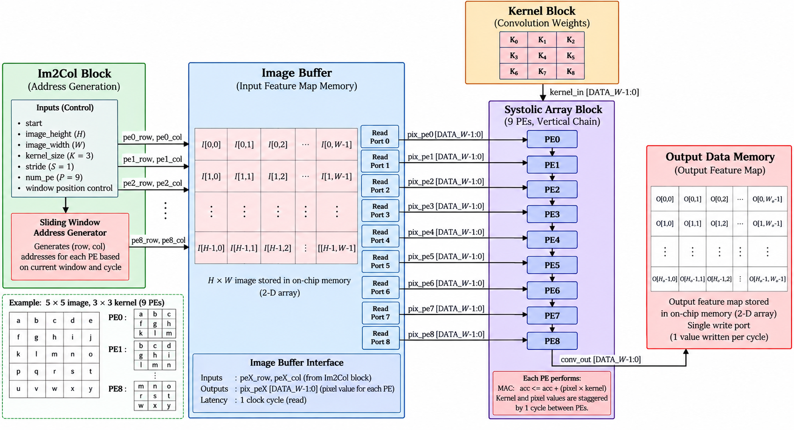
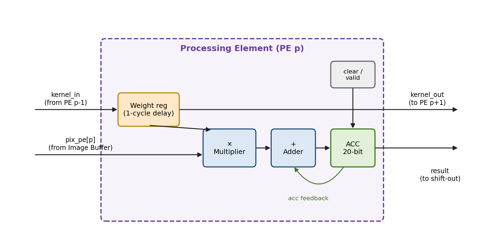
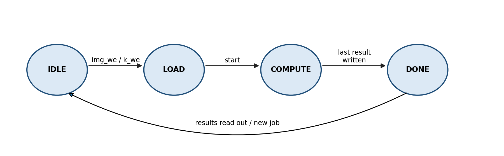
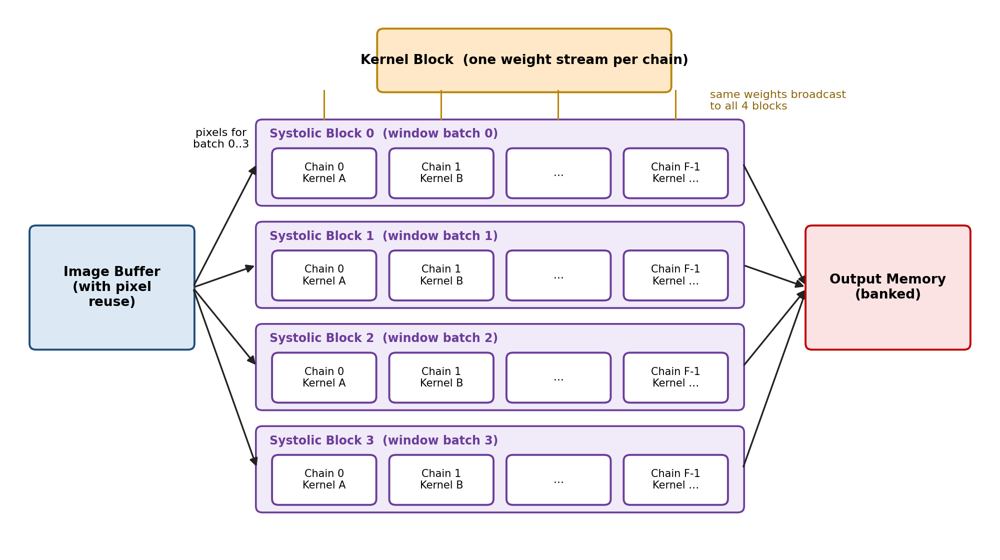

**Tools:** SystemVerilog · Python/NumPy (reference model) · Cadence Genus (synthesis) · Cadence Innovus (place & route)

📄 Full project report: [`docs/CNN_Accelerator_Project_Report.docx`](docs/CNN_Accelerator_Project_Report.docx)

---

## Table of Contents

- [Overview](#overview)
- [Key Features](#key-features)
- [Background](#background)
- [System Architecture](#system-architecture)
- [Dataflow and Worked Example](#dataflow-and-worked-example)
- [Processing Element](#processing-element)
- [Control Unit](#control-unit)
- [Parameters](#parameters)
- [Top-Level Interface](#top-level-interface)
- [Verification](#verification)
- [Physical Implementation Flow](#physical-implementation-flow)
- [Limitations](#limitations)
- [Future Work](#future-work)
- [Implementation Results](#implementation-results)
- [Repository Structure](#repository-structure)
- [References](#references)
- [Glossary](#glossary)

---

## Overview

Convolution accounts for most of the computation in a convolutional neural network (CNN), which makes it the main target for hardware acceleration. This project is a parameterized hardware accelerator, written in SystemVerilog, that performs 2-D convolution of a single-channel (grayscale) image with a 3×3 kernel.

The design combines two well-established techniques:

- **Implicit Im2Col addressing** – pixel addresses are generated on the fly instead of building an Im2Col matrix in memory.
- **1-D output-stationary systolic array** – each processing element (PE) accumulates one output while kernel weights flow through the chain with a one-cycle skew.

The baseline configuration processes a **5×5 image with nine PEs**, one per output window. All dimensions are parameters resolved at elaboration time, and the PE chain is built with SystemVerilog `generate` blocks. The design is verified against a Python reference model and implemented from RTL to GDSII with Cadence Genus and Innovus, within a one-month schedule.

A cycle-level analysis shows that in the baseline the nine PEs **never need more than two distinct pixels in the same cycle**, and every image pixel is needed in exactly one cycle. This motivates a pixel-reuse optimization, planned as the first item of future work along with a scaled architecture adding window-level and filter-level parallelism.

### Scope (baseline)

| Item | Value |
|------|-------|
| Input | Single-channel 5×5 image |
| Kernel | 3×3, stride 1, no padding |
| Data width | 8-bit |
| Output | 3×3 (9 windows × 9 MACs = 81 MACs) |

Multi-channel inputs, multiple kernels, larger images, and design-for-test are out of the one-month scope and described under [Future Work](#future-work). The design is parameterized so these extensions do not require rewriting the existing RTL.

## Key Features

- Fully parameterized, synthesizable SystemVerilog RTL
- Clean separation of address generation, image storage, kernel streaming, computation, and output storage
- Single kernel read port regardless of PE count (weights are reused as they travel down the chain)
- In-order result shift-out, one result per cycle, matching a single-write-port output memory
- Self-checking testbench driven by a Python/NumPy golden model
- Complete RTL → GDSII flow (Genus + Innovus), with STA, DRC, LVS, and SDF-annotated gate-level simulation

## Background

### 2-D Convolution

For an input image `I` and a `K×K` kernel `W` with stride `S`:

```
O[r][c] = Σ(i=0..K−1) Σ(j=0..K−1)  I[r·S + i][c·S + j] × W[i][j]

OUT_H = (IMG_H − K) / S + 1
OUT_W = (IMG_W − K) / S + 1
```

With stride 1, two horizontally adjacent windows share six of their nine pixels — a major opportunity for data reuse in hardware.

### Im2Col

Im2Col unrolls each window into a column so convolution becomes a matrix multiplication. Explicit Im2Col costs memory (for a 3×3 kernel with stride 1 the matrix is ~9× larger than the image). **Implicit Im2Col** never builds the matrix: an address generator computes, every cycle, which original pixel each column entry corresponds to and reads it directly from image memory. This project uses implicit Im2Col.

### Systolic Dataflows

| Dataflow | Stays in the PE | Moves between PEs | Typical benefit |
|----------|-----------------|-------------------|-----------------|
| Weight-stationary | Weights | Pixels and partial sums | Each weight fetched once, reused for many windows |
| **Output-stationary** (this design) | Partial sums | Weights and/or pixels | Partial sums never leave the PE until final |
| Input-stationary | Pixels | Weights and partial sums | Each pixel fetched once, reused for many weights |

Output-stationary avoids moving wide partial sums between PEs and extends naturally to multi-channel convolution, since a PE simply keeps accumulating across channels.

## System Architecture



*Figure 1. Top-level architecture of the accelerator.*

The design is divided into five blocks. Separating *which data* (Im2Col) from *where data is stored* (image buffer) lets either block change without affecting the other — important for the planned pixel-reuse optimization.

### 1. Im2Col Block (Address Generation)

For each of the `P` PEs, it produces a `(row, col)` address into the image buffer every cycle. If PE `p` owns the window starting at `(r₀, c₀)` and is processing kernel coefficient `k`:

```
row = r₀ + (k / K)
col = c₀ + (k mod K)
```

PE `p` is assigned window `p` in row-major order (PE0 → (0,0), PE1 → (0,1), … PE8 → (2,2)), and because of the weight skew, PE `p` processes coefficient `k = t − p` at cycle `t`.

> **Implementation note:** division and modulo are **not** built as hardware dividers. Small wrapping counters (kernel-column counter that increments a kernel-row counter on wrap) are used instead. Constants such as window origins are computed at elaboration time.

| Port | Dir | Width | Description |
|------|-----|-------|-------------|
| `clk`, `rst_n` | in | 1 | Clock and active-low reset |
| `start` | in | 1 | Begins address generation |
| `pe_row[p]`, `pe_col[p]` | out | `$clog2(IMG_H)`, `$clog2(IMG_W)` | Pixel address for PE p |
| `addr_valid[p]` | out | 1 | PE p has a valid address this cycle |

### 2. Image Buffer

Stores the input feature map as `image_mem[row][col]` of `DATA_W`-bit values, with one write port (load phase) and `P` independent read ports (1-cycle read latency). At 25 px × 8 bits = 200 bits it is built from flip-flops; each read port is effectively a 25-to-1 mux. An SRAM macro is not used because typical single/dual-port SRAMs cannot provide nine simultaneous reads.

| Port | Dir | Width | Description |
|------|-----|-------|-------------|
| `img_we`, `img_waddr`, `img_wdata` | in | 1, 5, 8 | Load interface, one pixel per cycle |
| `rd_row[p]`, `rd_col[p]` | in | 3, 3 | Read address for port p (from Im2Col) |
| `pix_pe[p]` | out | `DATA_W` | Pixel for PE p, valid one cycle after the address |

### 3. Kernel Block

Stores weights `K0..K8` in row-major order and sends one weight per cycle into PE0. Each PE registers the weight for one cycle and forwards it, creating a one-cycle skew: **at cycle `t`, PE `p` receives `K(t − p)`**.

| Cycle | PE0 | PE1 | PE2 | PE3 | … | PE8 |
|-------|-----|-----|-----|-----|---|-----|
| 0 | K0 | – | – | – | | – |
| 1 | K1 | K0 | – | – | | – |
| 2 | K2 | K1 | K0 | – | | – |
| 3 | K3 | K2 | K1 | K0 | | – |
| 8 | K8 | K7 | K6 | K5 | | K0 |
| 9 | done | K8 | K7 | K6 | | K1 |
| 16 | done | done | done | done | | K8 |

Because each weight is fetched once and reused by all PEs, the kernel block needs only **one output port** regardless of PE count.

### 4. Systolic Array

A 1-D chain of `P` PEs generated with a `generate` loop. Each PE takes its own pixel stream and the weight from the previous PE, multiplies, and accumulates. PE0 finishes at cycle 8, PE1 at cycle 9, …, PE8 at cycle 16 — results emerge **one per cycle, in order**.

### 5. Output Data Memory

A 2-D array `out_mem[row][col]` of `ACC_W`-bit values with a single write port. Results arrive through a shift-out path, one per cycle, and are read afterwards through the top-level read interface.

## Dataflow and Worked Example

**Input image** (letters a–y label positions, row-major):

|       | col 0 | col 1 | col 2 | col 3 | col 4 |
|-------|-------|-------|-------|-------|-------|
| row 0 | a = 3 | b = 1 | c = 4 | d = 1 | e = 5 |
| row 1 | f = 9 | g = 2 | h = 6 | i = 5 | j = 3 |
| row 2 | k = 5 | l = 8 | m = 9 | n = 7 | o = 9 |
| row 3 | p = 3 | q = 2 | r = 3 | s = 8 | t = 4 |
| row 4 | u = 6 | v = 2 | w = 6 | x = 4 | y = 3 |

**Kernel** (vertical-edge / Sobel-type):

|       | col 0 | col 1 | col 2 |
|-------|-------|-------|-------|
| row 0 | K0 = 1 | K1 = 0 | K2 = −1 |
| row 1 | K3 = 2 | K4 = 0 | K5 = −2 |
| row 2 | K6 = 1 | K7 = 0 | K8 = −1 |

**PE0 MAC sequence** (window a, b, c, f, g, h, k, l, m):

| Step k | Weight | Pixel | Product | Accumulator |
|--------|--------|-------|---------|-------------|
| 0 | K0 = 1 | a = 3 | 3 | 3 |
| 1 | K1 = 0 | b = 1 | 0 | 3 |
| 2 | K2 = −1 | c = 4 | −4 | −1 |
| 3 | K3 = 2 | f = 9 | 18 | 17 |
| 4 | K4 = 0 | g = 2 | 0 | 17 |
| 5 | K5 = −2 | h = 6 | −12 | 5 |
| 6 | K6 = 1 | k = 5 | 5 | 10 |
| 7 | K7 = 0 | l = 8 | 0 | 10 |
| 8 | K8 = −1 | m = 9 | −9 | **1** → `O[0][0]` |

**Expected output** (matches the Python reference model):

|       | col 0 | col 1 | col 2 |
|-------|-------|-------|-------|
| row 0 | 1 | −5 | 5 |
| row 1 | −5 | −7 | 2 |
| row 2 | −4 | −13 | 1 |

### Complete Pixel Schedule

`g·K4` means the PE multiplies pixel g by weight K4 in that cycle; **Distinct** counts the distinct pixels needed by the whole array.

| t | PE0 | PE1 | PE2 | PE3 | PE4 | PE5 | PE6 | PE7 | PE8 | Distinct |
|---|-----|-----|-----|-----|-----|-----|-----|-----|-----|----------|
| 0 | a·K0 | – | – | – | – | – | – | – | – | 1 |
| 1 | b·K1 | b·K0 | – | – | – | – | – | – | – | 1 |
| 2 | c·K2 | c·K1 | c·K0 | – | – | – | – | – | – | 1 |
| 3 | f·K3 | d·K2 | d·K1 | f·K0 | – | – | – | – | – | 2 |
| 4 | g·K4 | g·K3 | e·K2 | g·K1 | g·K0 | – | – | – | – | 2 |
| 5 | h·K5 | h·K4 | h·K3 | h·K2 | h·K1 | h·K0 | – | – | – | 1 |
| 6 | k·K6 | i·K5 | i·K4 | k·K3 | i·K2 | i·K1 | k·K0 | – | – | 2 |
| 7 | l·K7 | l·K6 | j·K5 | l·K4 | l·K3 | j·K2 | l·K1 | l·K0 | – | 2 |
| 8 | m·K8 | m·K7 | m·K6 | m·K5 | m·K4 | m·K3 | m·K2 | m·K1 | m·K0 | 1 |
| 9 | – | n·K8 | n·K7 | p·K6 | n·K5 | n·K4 | p·K3 | n·K2 | n·K1 | 2 |
| 10 | – | – | o·K8 | q·K7 | q·K6 | o·K5 | q·K4 | q·K3 | o·K2 | 2 |
| 11 | – | – | – | r·K8 | r·K7 | r·K6 | r·K5 | r·K4 | r·K3 | 1 |
| 12 | – | – | – | – | s·K8 | s·K7 | u·K6 | s·K5 | s·K4 | 2 |
| 13 | – | – | – | – | – | t·K8 | v·K7 | v·K6 | t·K5 | 2 |
| 14 | – | – | – | – | – | – | w·K8 | w·K7 | w·K6 | 1 |
| 15 | – | – | – | – | – | – | – | x·K8 | x·K7 | 1 |
| 16 | – | – | – | – | – | – | – | – | y·K8 | 1 |

Observations:

- **Pipeline fill and drain** – one computation takes `K² + P − 1 = 17` cycles for 81 MACs out of 153 slots (~53% utilization). When the chain is reused for further windows, fill/drain overlap and utilization approaches 100%.
- **Results finish in order** – along the K8 diagonal, one result per cycle.
- **Pixels are heavily shared** – at most **two** distinct pixels are needed in any cycle.

**Timing alignment:** the image buffer has 1-cycle read latency, so the weight stream into PE0 is delayed by one register stage so weight and matching pixel reach each PE in the same cycle.

### Latency

| Phase | Cycles (baseline) | Notes |
|-------|-------------------|-------|
| Load image | 25 | One pixel per cycle |
| Load kernel | 9 | Can overlap with image load if separate ports are used |
| Compute | 17 + 1 | `K² + P − 1` compute cycles + 1 cycle read latency |
| Write results | overlapped | Written one per cycle as PEs finish |
| Read results | 9 | One result per cycle |

For larger images the compute phase dominates and the chain approaches its peak throughput of `P` MACs per cycle.

## Processing Element



*Figure 2. Internal structure of one PE.*

- **Weight register** – captures the incoming weight and forwards it one cycle later (creates the systolic skew).
- **Multiplier** – 8-bit × 8-bit → 16-bit product.
- **Adder + accumulator** – adds the product to the running sum.
- **Control** – `clr` resets the accumulator at the start of a window; `en` (valid) prevents accumulation in idle cycles.

### Accumulator Width

```
ACC_W = 2·DATA_W + ⌈log₂(K²)⌉ = 2·8 + ⌈log₂ 9⌉ = 16 + 4 = 20 bits
```

Weights are signed (edge-detection filters have negative values). If pixels are also signed 8-bit, 20 bits suffice; if pixels are unsigned (0–255) they must be extended to 9 bits for signed multiplication and the accumulator needs 21 bits. This choice is fixed as an RTL parameter and documented in the testbench.

### Result Shift-Out

Since PEs finish exactly one cycle apart, each finished result is loaded into a result register that forms a chain toward the output memory. Results move out in order without conflicts — preferred over a P-to-1 mux because it keeps wiring local, in the systolic style.

## Control Unit



*Figure 3. Control FSM.*

| State | Activity | Exit condition |
|-------|----------|----------------|
| `IDLE` | Waits after reset; all PE accumulators cleared | A load write enable is asserted |
| `LOAD` | Image and kernel written through the load interface | `start` is asserted |
| `COMPUTE` | Kernel streaming, address generation, MACs, result write-back | Last PE result is written |
| `DONE` | `done` asserted; results readable | A new job begins |

During `COMPUTE`, a cycle counter drives the kernel and Im2Col blocks and generates per-PE `clr`/`en`: PE `p` is valid from cycle `p` to `p + K² − 1`. Since these signals are skewed like the weights, they can also be passed down the chain alongside the weights.

## Parameters

All sizes are parameters; derived values are `localparam` expressions/constant functions evaluated at elaboration, so they cost no hardware.

| Parameter | Baseline | Type | Meaning |
|-----------|----------|------|---------|
| `DATA_W` | 8 | Top-level | Pixel and weight width (bits) |
| `IMG_H`, `IMG_W` | 5, 5 | Top-level | Image height and width |
| `K` | 3 | Top-level | Kernel size (K × K) |
| `S` | 1 | Top-level | Stride |
| `NUM_PE` | 9 | Top-level | Number of PEs in the chain |
| `OUT_H`, `OUT_W` | 3, 3 | Derived | `(IMG − K) / S + 1` |
| `NUM_WIN` | 9 | Derived | `OUT_H × OUT_W` |
| `ACC_W` | 20 | Derived | `2·DATA_W + $clog2(K·K)` |
| `IMG_AW` | 5 | Derived | `$clog2(IMG_H · IMG_W)` |
| `K_AW` | 4 | Derived | `$clog2(K · K)` |
| `OUT_AW` | 4 | Derived | `$clog2(NUM_WIN)` |

> **Baseline limitation:** `NUM_PE == NUM_WIN`, so every window has its own PE. This only holds for small images (a 224×224 image has ~49,000 windows). The scaled design decouples the two by processing windows in batches.

```systemverilog
localparam int OUT_H   = (IMG_H - K) / S + 1;
localparam int OUT_W   = (IMG_W - K) / S + 1;
localparam int NUM_WIN = OUT_H * OUT_W;
localparam int ACC_W   = 2*DATA_W + $clog2(K*K);

genvar p;
generate
  for (p = 0; p < NUM_PE; p++) begin : g_pe
    pe #(.DATA_W(DATA_W), .ACC_W(ACC_W)) u_pe (
      .clk    (clk),        .rst_n (rst_n),
      .pix_in (pix[p]),
      .k_in   (k_chain[p]), .k_out (k_chain[p+1]),
      .clr    (clr[p]),     .en    (en[p]),
      .acc_out(acc[p])
    );
  end
endgenerate
```

## Top-Level Interface

Internal pixel buses are not exposed; narrow load/read interfaces are used instead, with address widths derived from parameters.

| Group | Signal | Dir | Width | Purpose |
|-------|--------|-----|-------|---------|
| Control | `clk` | in | 1 | System clock |
| Control | `rst_n` | in | 1 | Active-low reset |
| Control | `start` | in | 1 | Begin computation |
| Control | `done` | out | 1 | Computation finished |
| Image load | `img_we` | in | 1 | Image write enable |
| Image load | `img_addr` | in | 5 | Pixel index 0–24 |
| Image load | `img_wdata` | in | 8 | Pixel value |
| Kernel load | `k_we` | in | 1 | Kernel write enable |
| Kernel load | `k_addr` | in | 4 | Weight index 0–8 |
| Kernel load | `k_wdata` | in | 8 | Weight value |
| Result read | `out_addr` | in | 4 | Output index 0–8 |
| Result read | `out_rdata` | out | 20 | Output value |
| | **Total** | | **55** | |

### Operation Sequence

1. Assert `rst_n` low, then release it — the FSM enters `IDLE`.
2. Write the 25 pixels using `img_we`, `img_addr`, `img_wdata` (one per cycle).
3. Write the 9 weights using `k_we`, `k_addr`, `k_wdata` (one per cycle).
4. Pulse `start` for one cycle.
5. Wait until `done` is asserted.
6. Read the 9 results by applying each `out_addr` and sampling `out_rdata`.

If design-for-test is added later, three more pins (`scan_en`, `scan_in`, `scan_out`) are needed.

## Verification

- **Reference model** – a Python/NumPy script computes expected outputs directly from the convolution formula and writes image, kernel, and expected outputs to text files read by the testbench via `$readmemh`.
- **Self-checking testbench** – drives the top-level pins in the sequence above, compares every output with the expected value, and prints per-output pass/fail plus a summary.
- **Gate-level simulation** – the same testbench is re-run on the Genus netlist and on the post-route Innovus netlist with SDF back-annotation.

| Test | Purpose |
|------|---------|
| Worked example | Known values checkable by hand |
| Random images and kernels | General correctness (e.g. 1,000 random cases) |
| All-zero image or kernel | Accumulator clearing, no leftover values |
| Maximum-magnitude values | Accumulator width and overflow behaviour |
| Negative weights | Signed arithmetic |
| Back-to-back jobs | Correct state reset between computations |
| Identity kernel (centre = 1) | Address generation: output must equal window centres |

## Physical Implementation Flow

All steps are scripted in TCL so RTL changes only require re-running scripts.

### Logic Synthesis — Cadence Genus

| Inputs | Outputs |
|--------|---------|
| SystemVerilog RTL | Gate-level netlist (Verilog) |
| Standard-cell timing libraries (`.lib`) | Timing, area, and power reports |
| Timing constraints (SDC) | Constraints for Innovus (SDC) |

Starting SDC (tuned during the clock sweep):

```tcl
create_clock -name clk -period 5.0 [get_ports clk]
set_clock_uncertainty 0.3 [get_clocks clk]
set_input_delay  1.0 -clock clk [remove_from_collection [all_inputs] [get_ports clk]]
set_output_delay 1.0 -clock clk [all_outputs]
```

The critical path is expected through the multiplier and adder inside each PE. Because synthesis slack is optimistic (no real wires or clock tree), the target clock is set 10–20% below the synthesis limit; the final frequency is the one that passes setup and hold after routing.

### Place and Route — Cadence Innovus

| Step | What happens |
|------|--------------|
| Design import | Load netlist, SDC, timing libraries, and LEF |
| Floorplan | Core area and aspect ratio, I/O pins; 60–70% starting utilization |
| Power planning | Power rings and stripes for VDD/VSS |
| Placement | Position standard cells (wire length, timing, congestion) |
| Clock tree synthesis | Buffered clock tree with minimal skew |
| Routing | Connect all cells across routing layers |
| Post-route optimization | Fix remaining setup/hold violations |

The nine image-buffer read muxes all draw from the same 200 flip-flops, so this region is checked for routing congestion.

### Signoff

- Static timing analysis (setup/hold with extracted parasitics)
- Design rule check (DRC)
- Layout versus schematic (LVS)
- Gate-level simulation with SDF
- GDSII stream-out

### Schedule

| Week | Stage | Main tasks | Exit criterion |
|------|-------|------------|----------------|
| 1 | RTL & verification | RTL incl. FSM and shift-out; reference model; testbench; lint | All tests pass |
| 2 | Synthesis | SDC, clock sweep, reports, gate-level simulation | Clean netlist with timing margin |
| 3 | Place & route | Floorplan, power plan, placement, CTS, routing, optimization | No setup/hold violations |
| 4 | Signoff | STA, DRC, LVS, SDF simulation, GDSII export | DRC/LVS-clean GDSII |

## Limitations

- **Nine read ports** – read logic grows with PE count, though at most two distinct pixels are needed per cycle.
- **PEs tied to windows** – `NUM_PE == NUM_WIN` only works for small images.
- **Single channel, single kernel** – real CNN layers have many of each.
- **Flip-flop storage** – fine for 200 bits, not for realistic feature maps (need SRAM).
- **Load-dominated latency** – inherent to a 5×5 problem; disappears as images grow.
- **No design-for-test** – no scan chains in the baseline.

## Future Work

### Pixel Reuse

PE `p = 3a + b` handles the window at row `a`, column `b`, and at cycle `t` uses weight `k = t − p = 3i + j`. The pixel it needs is at `R = a + i`, `C = b + j`, so:

```
t = p + k = (3a + b) + (3i + j) = 3(a + i) + (b + j) = 3R + C
```

Every active PE at cycle `t` needs a pixel with `3R + C = t`; with `C ∈ [0, 4]` there are at most two such pixels. Consequences for the baseline:

- **Two ports suffice** – nine 25-to-1 muxes can be replaced by two, plus a 2-to-1 selector per PE.
- **Each pixel is fetched exactly once** – `9×1 + 8×2 = 25` reads instead of 81 (~3.2× reduction).

For other image/kernel sizes the pattern must be re-derived; a line buffer is the standard general solution. Both versions will be synthesized to measure area, power, and congestion savings.

### Scaled Architecture



*Figure 4. Scaled architecture: four systolic blocks, each with F kernel chains.*

- **Window parallelism** – four systolic blocks process four window batches simultaneously, with weights broadcast from one kernel stream.
- **Filter parallelism** – inside each block, `F` PE chains apply `F` kernels to the same windows and share one set of pixel ports.

Layers with more kernels than chains, or larger images, are processed in multiple passes/batches. This requires pixel reuse (to keep read logic manageable) and a banked output memory (up to `4F` results per cycle).

### Other Extensions

- **Multi-channel inputs** – PEs keep accumulating across channels; add a channel counter and `⌈log₂ C_in⌉` accumulator bits.
- **Design-for-test** – scan insertion in Genus, ATPG and fault coverage with Cadence Modus.
- **SRAM-based storage** – once pixel reuse reduces read ports, use SRAM macros (`.lib`, LEF, Verilog model, GDS, LVS netlist).

## Implementation Results

*To be completed after implementation.*

| Metric | Synthesis (Genus) | Post-route (Innovus) |
|--------|-------------------|----------------------|
| Technology node | | |
| Target clock period (ns) | | |
| Achieved frequency (MHz) | | |
| Worst setup slack (ns) | | |
| Worst hold slack (ns) | — | |
| Standard-cell area (µm²) | | |
| Number of cells | | |
| Core utilization (%) | — | |
| Total power (mW) | | |
| DRC violations | — | |
| LVS result | — | |

## Repository Structure

```
.
├── README.md
└── docs/
    ├── CNN_Accelerator_Project_Report.docx   # Full project report
    └── images/
        ├── top_level_architecture.png
        ├── processing_element.png
        ├── control_fsm.png
        └── scaled_architecture.png
```

## References

1. H.T. Kung, "Why Systolic Architectures?", *IEEE Computer*, vol. 15, no. 1, 1982.
2. H.T. Kung and R.L. Picard, "One-Dimensional Systolic Arrays for Multidimensional Convolution and Resampling," in *VLSI for Pattern Recognition and Image Processing*, Springer, 1984.
3. "BP-Im2col: Implicit Im2col Supporting AI Backpropagation on Systolic Arrays," arXiv:2209.09434, 2022.
4. C. Zhang, P. Li, G. Sun, Y. Guan, B. Xiao, and J. Cong, "Optimizing FPGA-based Accelerator Design for Deep Convolutional Neural Networks," *Proc. ACM/SIGDA FPGA*, 2015.
5. Y. Ma, Y. Cao, S. Vrudhula, and J. Seo, "Optimizing Loop Operation and Dataflow in FPGA Acceleration of Deep Convolutional Neural Networks," *Proc. ACM/SIGDA FPGA*, 2017.

## Glossary

| Term | Meaning |
|------|---------|
| ATPG | Automatic test pattern generation |
| CTS | Clock tree synthesis |
| DRC | Design rule check |
| Elaboration | Step where tools resolve parameters and build the hierarchy |
| GDSII | Standard file format for a finished chip layout |
| Im2Col | Rearranging convolution windows into matrix columns |
| LEF | Library Exchange Format (physical abstract of cells/macros) |
| LVS | Layout versus schematic |
| MAC | Multiply-accumulate: `acc = acc + a × b` |
| Output-stationary | Dataflow in which partial sums stay inside each PE |
| PE | Processing element: one MAC unit with its registers |
| SDC | Synopsys Design Constraints |
| SDF | Standard Delay Format |
| Slack | Margin by which a timing path meets (+) or misses (−) its requirement |
| Stride | Step size by which the kernel moves between windows |
| Systolic array | Array of PEs passing data rhythmically to neighbours |
| Window | Image region covered by the kernel at one position |
